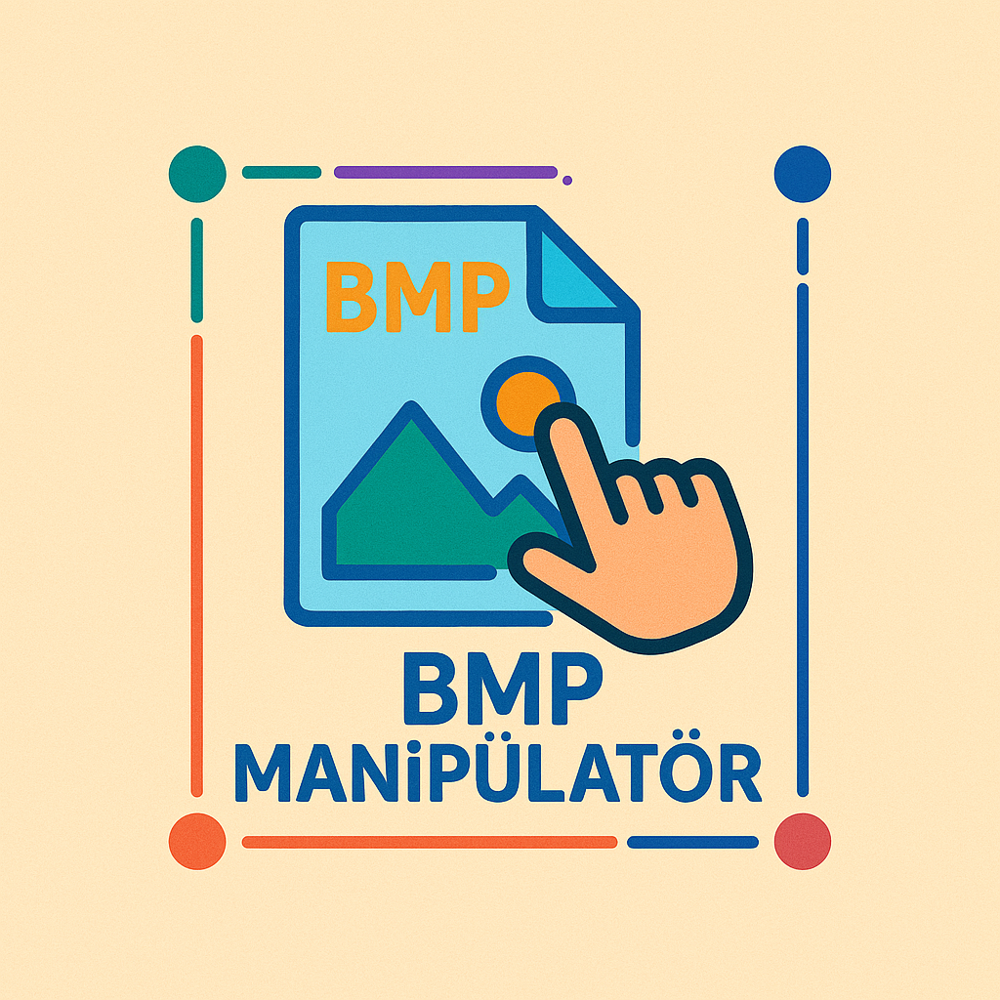

# BMP Manipülatörü

Metadata işlemleri ve steganografi odaklı kapsamlı bir BMP dosya manipülasyon aracı.



[](LICENSE)
[](https://github.com/soyluoltu/bmp-manipulator/actions)
[](https://github.com/soyluoltu/bmp-manipulator/releases)

## Giriş

BMP Manipülatörü, BMP (Bitmap) dosyalarıyla temel görüntü düzenlemenin ötesinde çalışmak için özelleştirilmiş bir kütüphanedir. BMP formatının genellikle gözden kaçan yönlerine odaklanır: başlıklar, metadata ve steganografi dahil çeşitli amaçlar için kullanılabilecek kullanılmayan alanlar.

## Temel Özellikler

- **Tam BMP Başlık Yönetimi**
  - BMP başlıklarının tüm yönlerini inceleme, değiştirme ve genişletme
  - Tüm BMP başlık versiyonları ve yapıları için destek
  - Başlık bütünlüğü için gelişmiş doğrulama

- **Genişletilmiş Metadata İşlemleri**
  - BMP dosyalarına özel metadata alanları ekleme
  - Mevcut metadataları çıkarma ve yorumlama
  - Standartlara uygun ve özel metadata formatları için destek

- **Steganografi Araç Seti**
  - Çoklu steganografi algoritmaları (LSB, Palet manipülasyonu, vb.)
  - Özelleştirilebilir veri gizleme stratejileri
  - Gizli veriler için şifreleme desteği
  - Steganaliz ve tespit için araçlar

- **Geliştirici Dostu Tasarım**
  - Programatik kullanım için temiz API
  - Kapsamlı CLI komutları
  - Detaylı belgelendirme ve örnekler

## BMP Yapısına Genel Bakış

BMP dosya formatı birkaç temel bileşenden oluşur:

1. **Dosya Başlığı (14 bayt)**
   - Dosya türü, boyutu ve piksel verisine offset

2. **DIB Başlığı (değişken boyut)**
   - Görüntü boyutları, renk derinliği ve sıkıştırma bilgisi
   - Farklı sürümleri: BITMAPINFOHEADER (40 bayt), BITMAPV4HEADER (108 bayt), BITMAPV5HEADER (124 bayt)

3. **Renk Paleti (isteğe bağlı)**
   - 8-bit veya daha düşük renk derinliğindeki görüntüler için

4. **Bit Maskesi (isteğe bağlı)**
   - Bazı renk formatları için

5. **Piksel Verisi**
   - Satır başına 4-baytlık hizalama gerektirir
   - Alt-üst yapılandırması (aşağıdan yukarıya doğru dizilir)

6. **ICC Renk Profili (isteğe bağlı, BITMAPV5HEADER ile)**
   - Renk yönetimi için

7. **Özel Metadata Alanları (bu proje ile)**
   - Standart yapıda tanımlanmayan ek veriler

## Metadata İşlemleri

BMP Manipülatörü, BMP dosyalarında bulunan standart metadata alanları dışında özel metadata eklemek için birkaç yöntem sunar:

### Metadata Ekleme Yöntemleri

1. **Başlık Genişletmesi**
   - DIB başlığının kullanılmayan alanlarını kullanma
   - BITMAPV5HEADER'ın rezerve edilmiş alanlarını kullanma

2. **Application Extension Blocks**
   - Piksel verisinden sonra özel bloklar ekleme
   - Uygulamaya özel tanımlayıcılar kullanma

3. **Metadata Bölümleri**
   - Dosya sonuna metadata eklemek için özel format
   - Başlıkta referans olmadan gizli veri saklama

### Metadata Formatları

- **Anahtar-Değer Çiftleri**
  - Basit metin tabanlı metadata
  - JSON formatında yapılandırılmış veriler

- **XMP Metadata**
  - Adobe XMP formatı ile uyumlu
  - Standartlaştırılmış metadata şemaları

- **Özel İkili Formatlar**
  - Özel uygulamalar için optimize edilmiş
  - Sıkıştırılmış veya şifrelenmiş metadata

## Steganografi Özellikleri

BMP Manipülatörü, çeşitli steganografi tekniklerini destekler:

### Desteklenen Teknikler

1. **En Az Önemli Bit (LSB) Steganografisi**
   - Piksel verilerinin en az önemli bitlerinde bilgi gizleme
   - Ayarlanabilir bit derinliği (1-4 bit)
   - Kanal seçimi (R, G, B veya tümü)

2. **Palet Tabanlı Steganografi**
   - Paletli BMP'lerde renkler arasındaki sıralamayı değiştirme
   - Görsel değişiklikler olmadan veri gizleme

3. **Başlık Alanı Steganografisi**
   - Kullanılmayan veya az kullanılan başlık alanlarında veri gizleme
   - Görüntü verisi etkilenmeden veri saklama

4. **Boş Alan Kullanımı**
   - Piksel verisi ve dosya sonu arasındaki boşluğu kullanma
   - Yüksek kapasite, düşük tespit edilebilirlik

### Güvenlik Özellikleri

- **Şifreleme Entegrasyonu**
  - AES-256, ChaCha20 gibi modern şifreleme algoritmaları
  - Steganografi öncesi veri şifreleme

- **Dağıtılmış Gizleme**
  - Verinin dosya genelinde dağıtılması
  - Tespit zorluğunu arttırma

- **Sahte Positif Enjeksiyonu**
  - Steganaliz araçlarını yanıltmak için sahte veri
  - Gerçek gizli veriyi maskeleme

## Kurulum

```bash
# Git deposunu klonlama
git clone https://github.com/soyluoltu/bmp-manipulator.git
cd bmp-manipulator

# Gerekli bağımlılıkları kurma
pip install -r requirements.txt

# Test çalıştırma
python -m unittest discover
```

## Hızlı Başlangıç

### BMP Başlığını İnceleme

```python
from bmp_manipulator import BMPFile

# BMP dosyasını yükleme
bmp = BMPFile("ornek.bmp")

# Başlık bilgilerini görüntüleme
print(f"Dosya Boyutu: {bmp.file_size} bayt")
print(f"Piksel Veri Ofset: {bmp.pixel_data_offset}")
print(f"Görüntü Boyutu: {bmp.width}x{bmp.height}")
print(f"Renk Derinliği: {bmp.bits_per_pixel} bit")
```

### Metadata Ekleme

```python
from bmp_manipulator import BMPFile, Metadata

# BMP dosyasını yükleme
bmp = BMPFile("ornek.bmp")

# Yeni metadata oluşturma
meta = Metadata()
meta.add("Başlık", "Örnek BMP Dosyası")
meta.add("Yazar", "BMP Manipülatör Kullanıcısı")
meta.add("Oluşturulma Tarihi", "2023-11-01")

# Metadata'yı BMP'ye ekleme
bmp.add_metadata(meta)

# Dosyayı kaydetme
bmp.save("metadata_ekli.bmp")
```

### Steganografi Örneği

```python
from bmp_manipulator import BMPFile, LSBSteganography

# BMP dosyasını yükleme
bmp = BMPFile("taşıyıcı.bmp")

# Steganografi modülünü başlatma
stego = LSBSteganography(bmp)

# Metin mesaj gizleme
stego.hide_text("Bu gizli bir mesajdır.", password="güvenli_parola")

# Dosyayı kaydetme
bmp.save("gizli_mesaj_içeren.bmp")

# Mesajı çıkarma
extracted = LSBSteganography.extract_text("gizli_mesaj_içeren.bmp", password="güvenli_parola")
print(f"Çıkarılan Mesaj: {extracted}")
```

## CLI Kullanımı

BMP Manipülatörü, temel işlemler için kullanımı kolay bir komut satırı arayüzü sağlar:

```bash
# BMP bilgilerini görüntüleme
python -m bmp_manipulator info ornek.bmp

# Metadata ekleme
python -m bmp_manipulator metadata add ornek.bmp --key "Başlık" --value "Örnek Görüntü"

# Metadata çıkarma
python -m bmp_manipulator metadata extract metadata_ekli.bmp

# Metin gizleme (steganografi)
python -m bmp_manipulator stego hide taşıyıcı.bmp --text "Gizli mesaj" --output gizli.bmp

# Gizli metni çıkarma
python -m bmp_manipulator stego extract gizli.bmp
```

## BMP Formatı Detayları
### Daha detaylı bilgi için [Buraya Tıklayın...][https://github.com/soyluoltu/bmp-manipulations/blob/main/bmp-structure.md]
### Dosya Başlığı (BITMAPFILEHEADER)

| Offset | Boyut | Ad | Açıklama |
|--------|-------|----------------|-------------|
| 0x00 | 2 | bfType | "BM" (0x4D42) imzası |
| 0x02 | 4 | bfSize | Dosyanın toplam boyutu (bayt) |
| 0x06 | 2 | bfReserved1 | Rezerve edilmiş (genellikle 0) |
| 0x08 | 2 | bfReserved2 | Rezerve edilmiş (genellikle 0) |
| 0x0A | 4 | bfOffBits | Piksel verilerine offset |

### DIB Başlığı (BITMAPINFOHEADER)

| Offset | Boyut | Ad | Açıklama |
|--------|-------|----------------|-------------|
| 0x0E | 4 | biSize | Başlık boyutu (40 bayt) |
| 0x12 | 4 | biWidth | Görüntü genişliği (piksel) |
| 0x16 | 4 | biHeight | Görüntü yüksekliği (piksel) |
| 0x1A | 2 | biPlanes | Renk düzlemleri (genellikle 1) |
| 0x1C | 2 | biBitCount | Piksel başına bit sayısı |
| 0x1E | 4 | biCompression | Sıkıştırma yöntemi |
| 0x22 | 4 | biSizeImage | Görüntü verisi boyutu |
| 0x26 | 4 | biXPelsPerMeter | Yatay çözünürlük |
| 0x2A | 4 | biYPelsPerMeter | Dikey çözünürlük |
| 0x2E | 4 | biClrUsed | Palet girişi sayısı |
| 0x32 | 4 | biClrImportant | Önemli renkler |

## Katkıda Bulunma

BMP Manipülatörü projesine katkıda bulunmak isterseniz:

1. Bu depoyu fork edin
2. Özellik dalınızı oluşturun (`git checkout -b özellik/yeni-özellik`)
3. Değişikliklerinizi commit edin (`git commit -am 'Yeni özellik: X ekle'`)
4. Dalınıza push yapın (`git push origin özellik/yeni-özellik`)
5. Bir Pull Request oluşturun

## Lisans

Bu proje MIT Lisansı altında lisanslanmıştır. Detaylar için [LICENSE](LICENSE) dosyasına bakın.

## İletişim

Sorular, öneriler veya geri bildirimler için:
- GitHub Issues: [github.com/soyluoltu/bmp-manipulator/issues](https://github.com/soyluoltu/bmp-manipulator/issues)
